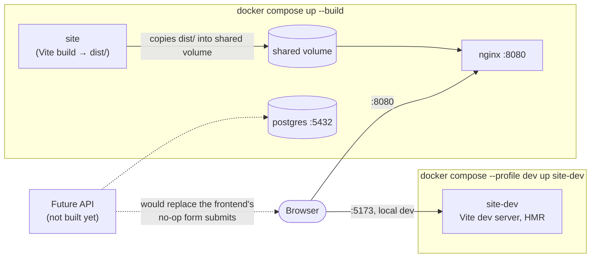

# Architecture

A quick map of how the pieces fit together, for anyone landing in this repo
for the first time.

```
prototype-restoraunt/
├── site/            React (Vite) frontend — the actual public website
├── db/              PostgreSQL schema + migrations (Prisma), data layer only
├── nginx/           Reverse proxy config used by the Docker stack
├── docker-compose.yml
└── Marigold Arms.dc.html   Original static prototype the site was built from
```

## Diagram



`site` and `site-dev` are two build targets of the same Dockerfile (`build`
and `dev`), never both running at once for the same purpose — `site` is
the one-shot builder behind the default `docker compose up`, `site-dev` is
the opt-in live-reload path. `postgres` sits ready for a backend that
doesn't exist yet; see [API.md](API.md).

## Frontend (`site/`)

- **Vite + React 18 + React Router 6.** Client-side routed SPA, no server
  rendering.
- **Styling** is a port of the `_ds/classical-*` design system into
  `src/index.css` as CSS custom properties, plus a handful of Tailwind v4
  utilities. Three colour palettes live as `[data-palette]` blocks and are
  switched at runtime (persisted to `localStorage`).
- **Animation** leans on Framer Motion for scroll reveals, route
  transitions and the hero slideshow; small hover/lift effects are plain
  CSS transitions. See `site/README.md` for the full rundown.
- **Data** for menus, drinks, images, etc. is static, hand-written JS under
  `src/data/` — there is no CMS or backend call on the frontend today.

## Data layer (`db/`)

PostgreSQL + Prisma schema for the domain the site will eventually need a
backend for: clients, reservations (from the Visit page's booking form) and
newsletter signups. **Nothing reads or writes to it yet** — no API sits in
front of it. It exists so the schema can be designed and migrated
independently of whichever backend ends up serving it. See
[`db/README.md`](db/README.md) and [API.md](API.md) for more.

## Deployment (`docker-compose.yml`, `nginx/`)

Three services:

- `postgres` — the database above.
- `site` — builds the frontend and copies the static `dist/` output into a
  shared volume (it doesn't stay running).
- `nginx` — serves that `dist/` volume on `:8080`, configured to fall back
  to `index.html` for client-side routes.

A `site-dev` profile bind-mounts the source for live-reloading Vite dev
work inside Docker instead of the build → nginx pipeline.

CI (`.github/workflows/ci.yml`) lints and builds the frontend, then brings
up this same Compose stack and runs the Playwright e2e suite against it on
every push/PR.

## Why the split

The frontend, data layer and reverse proxy are kept as separate
Docker Compose services (rather than one monolith) so a real API can be
slotted in between the frontend and the database later without
restructuring anything that already works.
