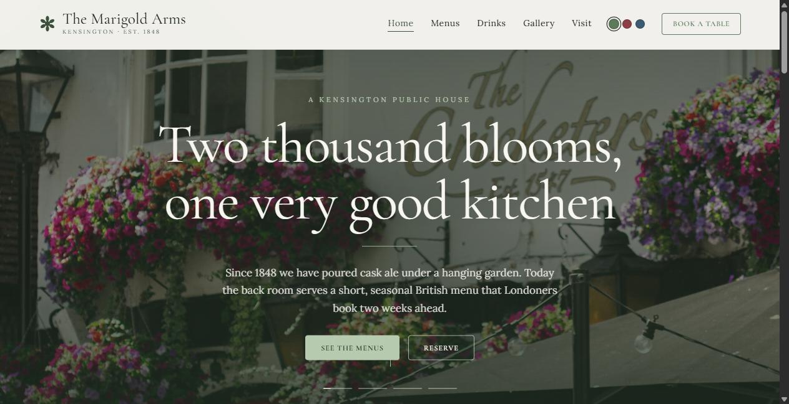
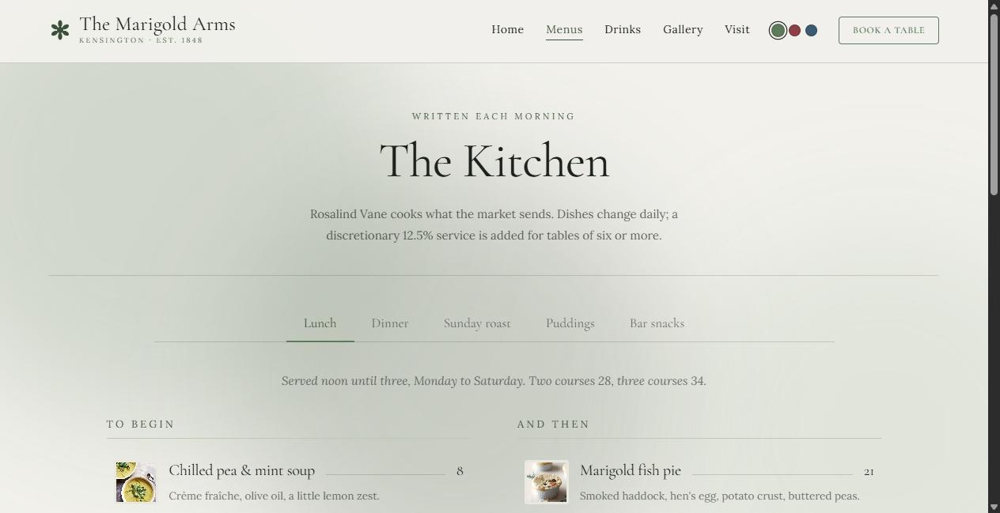
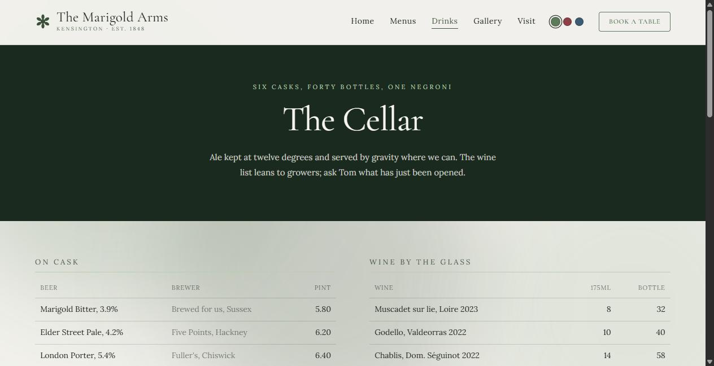
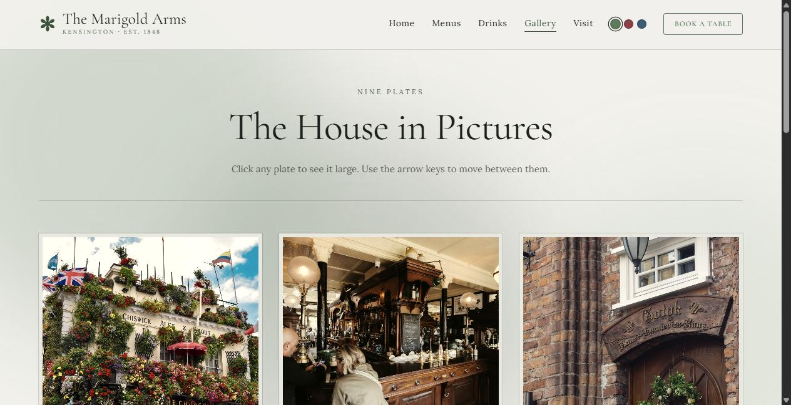
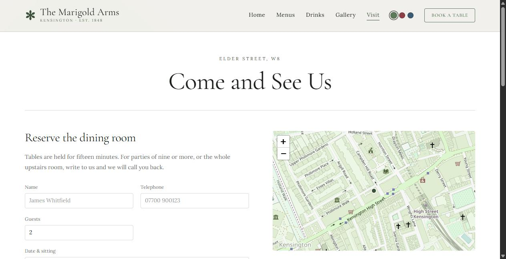

# The Marigold Arms

A fictional Kensington pub site — a React/Vite frontend, a Postgres data
layer for reservations, and a Docker Compose stack tying them together
behind nginx. Built as a sales/portfolio prototype.

| Home | Menus |
| --- | --- |
|  |  |

| Drinks | Gallery |
| --- | --- |
|  |  |

| Visit |
| --- |
|  |

## Quick start

```bash
cd site
npm install
npm run dev      # http://localhost:5173
```

Or the full stack (frontend + Postgres, served through nginx):

```bash
docker compose up --build   # http://localhost:8080
```

## Docs

- **[ARCHITECTURE.md](ARCHITECTURE.md)** — how the frontend, database and
  Docker/nginx pieces fit together.
- **[API.md](API.md)** — the data schema (there's no live API yet; this
  covers the Postgres/Prisma layer it will be built on).
- **[CONTRIBUTING.md](CONTRIBUTING.md)** — local setup, lint/build/e2e
  checks, and code conventions.
- **[site/README.md](site/README.md)** — frontend-specific detail: stack,
  routes, animation, images, deploying.
- **[db/README.md](db/README.md)** — the Postgres/Prisma data layer.

## License

[MIT](LICENSE)
