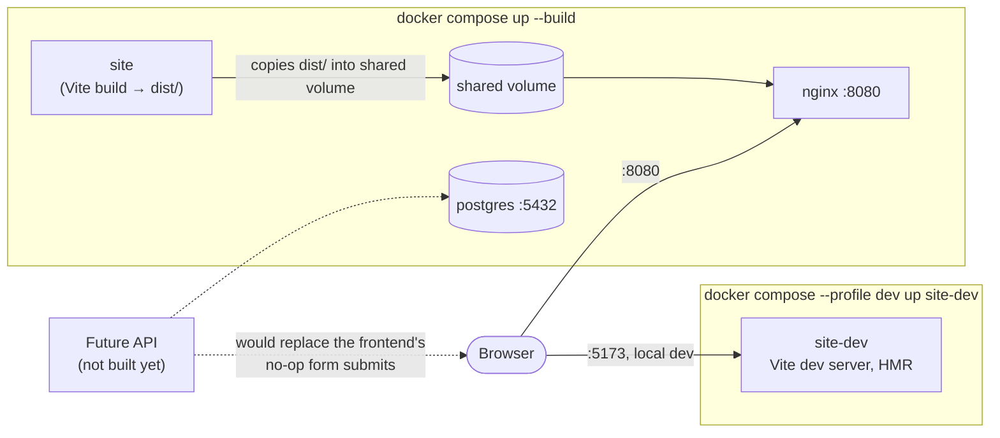

# The Marigold Arms

A fictional Kensington pub site — a React/Vite frontend, a Postgres data
layer for reservations, and a Docker Compose stack tying them together
behind nginx. Built as a sales/portfolio prototype.

| Home | Menus |
| --- | --- |
|  |  |

| Drinks | Gallery |
| --- | --- |
|  |  |

| Visit |
| --- |
|  |

## Stack

Vite · React 18 · React Router 6 · Tailwind v4 (reset + a few utilities) ·
Framer Motion — for the frontend in [`site/`](site). PostgreSQL + Prisma
for the data layer in [`db/`](db). Docker Compose + nginx to run the two
together; see [API.md](API.md) for why there's a database but no API yet.

## Run it

```bash
cd site
npm install
npm run dev      # http://localhost:5173
```

Or the full stack (frontend + Postgres, served through nginx):

```bash
docker compose up --build   # http://localhost:8080
```

## Architecture



Frontend, data layer and reverse proxy are separate Compose services so a
real API can be slotted in between the frontend and the database later
without restructuring anything that already works. Full breakdown,
including why each piece is split out this way, in
**[ARCHITECTURE.md](ARCHITECTURE.md)**.

## Layout

Routes served by the frontend (`site/src/`):

| Path | Page |
| --- | --- |
| `/` | Home — hero slideshow, story, features, signature dishes, dining room |
| `/menus` | Five services as tabs; the active one is mirrored to `?service=` |
| `/drinks` | Cask, cocktail and wine lists |
| `/gallery` | Nine plates with a keyboard-navigable lightbox |
| `/visit` | Booking form with validation (nothing is sent) and details |
| `*` | Not found |

Styling is a port of the `_ds/classical-*` design system into
`site/src/index.css` as CSS custom properties and component classes; menu,
drinks and image content is static data under `site/src/data/`. Full
detail in [`site/README.md`](site/README.md).

## API

**There is no live API.** The Visit page's booking form and the newsletter
signup are frontend-only — they validate and stop there. What exists is
the Postgres/Prisma schema (`Client`, `Reservation`, `NewsletterSignup`)
in [`db/`](db) that a future backend will be built against — see
**[API.md](API.md)**.

## Tests

From `site/`:

```bash
npm run lint      # eslint
npm run build     # production build
npm run test:e2e  # Playwright, against the Docker compose stack
```

CI (`.github/workflows/ci.yml`) runs all three on every push/PR. See
[CONTRIBUTING.md](CONTRIBUTING.md) for running the e2e suite locally the
way CI does.

## Contributing

Setup, checks to run before a PR, and code conventions are in
**[CONTRIBUTING.md](CONTRIBUTING.md)**.

## License

[MIT](LICENSE)
